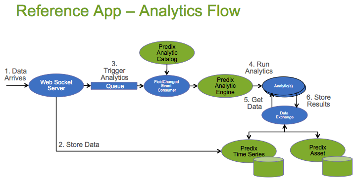

<a href="http://predixdev.github.io/predix-rmd-analytics-ref-app" target="_blank">
	
</a>
# predix-rmd-ref-analytics-app


###Analytics Flow
Data arrives via the Ingestion Flow and is stored.  A message is placed in a queue which kicks off an Analytic Orchestration.  The Analytics uses data from Predix Asset and Predix Timeseries, produces a result, which is then stored back to Predix Asset or Predix Timeseries or potentially to/from any other datastore.



##Setting up your environment
Reference App accesses code repos at https://github.com/PredixDev and a maven repository at https://artifactory.predix.io.  Artifactory is password protected, [follow instructions here](https://www.predix.io/resources/tutorials/tutorial-details.html?tutorial_id=1560&tag=1608&journey=Development%20tools%20and%20tips&resources=1565,1560,1727) to set up.

The best experience is to use a [DevBox](https://www.predix.io/catalog/other-resources/devbox.html) which has all the tools and settings pre-installed.  

Follow the instructions in the below link on how to setup your development environment:
https://www.predix.io/resources/tutorials/journey.html#1607

##Getting Acquainted with RMD Reference App

RMD Analytics App uses RMD Reference App as a pre-requisite to set up Predix Asset, Predix Timeseries and Predix UAA.  Go through the following tutorial to get acquainted with and install the Predix [RMD Reference application](https://www.predix.io/resources/tutorials/tutorial-details.html?tutorial_id=1473&tag=1610&journey=Connect%20devices%20using%20the%20Reference%20App&resources=1592,1473,1600)

##Installing RMD Analytics App

Tutorial coming soon.  In the mean time, from a command window navigate to the RMD Analytics directory and run the installer.  At the end of the install script follow the instructions provided to execute the Analytics flow.
```
python scripts/installAnalyticsRefApp.py
```


##Predix Hello World
Go through the following tutorial on how to build a simple hello world application using Predix components.

https://www.predix.io/resources/tutorials/journey.html#1719

##Microservices
The Analytics part of the reference App consists of several microservices. Each microservice can be individually managed and scaled, leveraging the Cloud Foundry infrastructure. These services can be mixed and matched for your next Predix application depending on which services you need to integrate with.

The names of services, apps and ids, e.g. the default UAA configuration configured, for the RMD Analytics reference application is located under scripts/refAnalyticsAppConfig.py folder
 ```
 rmdAppClientId = "app_client_id"
 rmdAppSecret = "secret"
 uaaAdminSecret = "secre"
 ```
 
###[FDH-Router-service - DataExchange](https://github.com/PredixDev/fdh-router-service#fdh-router-service)
###[RMD-Analytics-service](https://github.com/PredixDev/rmd-analytics)
###[RMD-Orchestration-service](https://github.com/PredixDev/rmd-orchestration)
###[RabbitMQ-service](https://www.predix.io/services/service.html?id=1182)

##APIs
The reference app defines some apis and message bodies that are needed to communicate between microservices.
* [Run Analytic](https://github.com/PredixDev/ext-interface)
* [Federated Datahandler](https://github.com/PredixDev/ext-interface)
* [FieldChangedEvent](https://github.com/PredixDev/ext-interface)

[](https://github.com/PredixDev)
